# RedAudit

[](README_ES.md)

Structured network auditing and hardening for Kali/Debian systems — interactive wizard + CI-friendly CLI outputs.


<details>
<summary>Banner</summary>

```text
 ____          _    _             _ _ _
|  _ \ ___  __| |  / \  _   _  __| (_) |_
| |_) / _ \/ _` | / _ \| | | |/ _` | | __|
|  _ <  __/ (_| |/ ___ \ |_| | (_| | | |_
|_| \_\___|\__,_|/_/   \_\__,_|\__,_|_|\__|
        Interactive Network Audit Tool
```

</details>

## Quick start

```bash
git clone https://github.com/dorinbadea/RedAudit.git
cd RedAudit
sudo bash redaudit_install.sh
```

Run the interactive wizard:

```bash
sudo redaudit
```

Or run non-interactively:

```bash
sudo redaudit --target 192.168.1.0/24 --mode normal --yes
```

## Documentation

- Usage (flags + examples): `docs/en/USAGE.md`
- Manual (install, concepts, outputs): `docs/en/MANUAL.md`
- Report schema: `docs/en/REPORT_SCHEMA.md`
- Security model & updater notes: `docs/en/SECURITY.md`
- Troubleshooting: `docs/en/TROUBLESHOOTING.md`
- Changelog: `CHANGELOG.md`

## What you get

RedAudit orchestrates standard tools (e.g., `nmap`, `whatweb`, `nikto`, `testssl.sh`) into a consistent pipeline and produces artifacts ready for reporting and SIEM ingestion.

Key capabilities:

- Adaptive deep identity scan (TCP + UDP) with best-effort PCAP capture
- Optional topology discovery and enhanced broadcast/L2 discovery (`--topology`, `--net-discovery`)
- Opt-in Red Team recon inside net discovery (`--redteam`, guarded; requires root)
- Full `--dry-run` support (no external commands executed; commands are printed)
- HTML dashboard + JSONL exports + remediation playbooks (skipped when encryption is enabled)

## Outputs

Each run creates a timestamped folder (default: `~/Documents/RedAuditReports/RedAudit_YYYY-MM-DD_HH-MM-SS/`) containing:

- `redaudit_<timestamp>.json` and `redaudit_<timestamp>.txt` (or `.enc` + `.salt` if encrypted)
- `report.html` (HTML dashboard, when encryption is disabled)
- `findings.jsonl`, `assets.jsonl`, `summary.json` (flat exports for SIEM/AI, when encryption is disabled)
- `run_manifest.json` (counts + artifact list, when encryption is disabled)
- `playbooks/` (Markdown remediation guides, when encryption is disabled)
- `traffic_*.pcap` (best-effort micro-captures during deep scan when available)

## Safety & requirements

- Run with `sudo` for full functionality (raw sockets, OS detection, `tcpdump`/captures). Limited mode exists: `--allow-non-root`.
- Red Team features are opt-in and intended for authorized assessments only.
- If you update and the banner/version does not refresh, restart the terminal or run `hash -r`.

## Architecture

System overview (current image):


Module map (Mermaid, rendered SVG):



Source: `docs/images/architecture_modules.mmd`

## Contributing

See `.github/CONTRIBUTING.md`.

## License

GNU GPLv3. See `LICENSE`.
